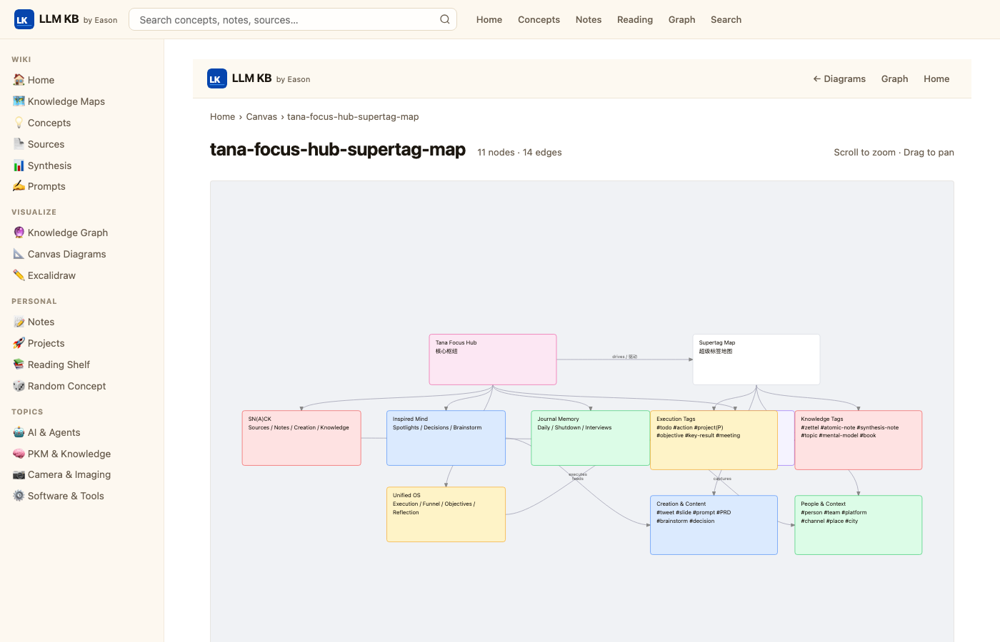
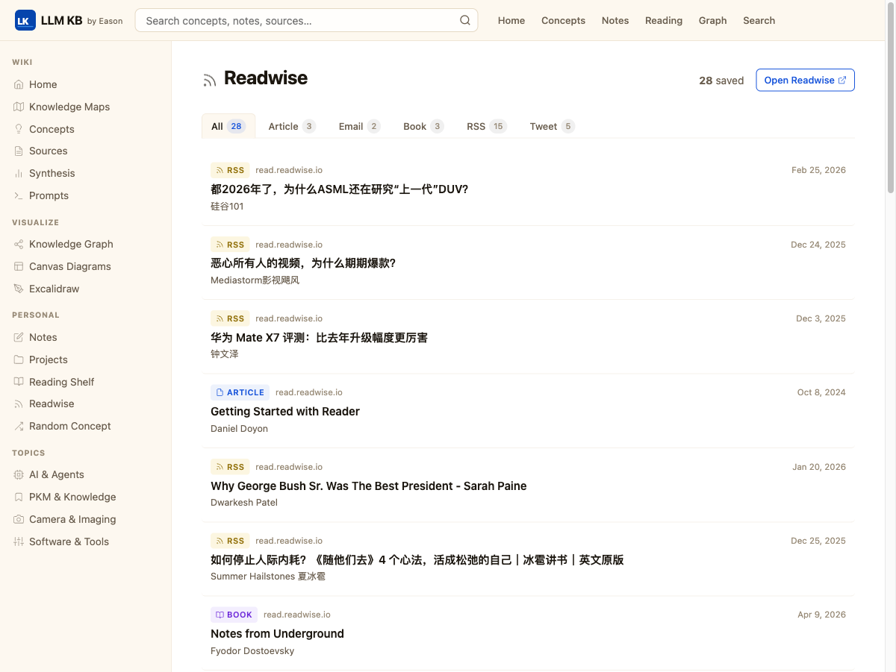
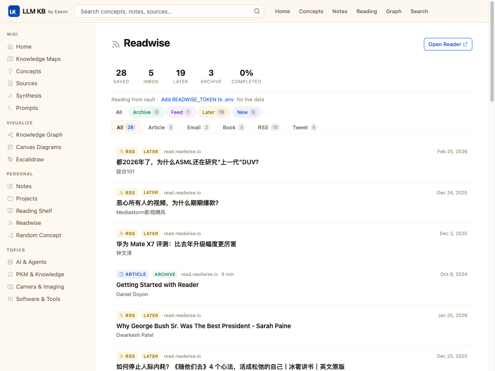

# LLM WIPA — Eason's Personal Knowledge Base

> **W**ikipedia-**I**nspired **P**ersonal **A**rchive  
> A local web interface for Obsidian vaults — built by Eason, for anyone who thinks in networks.

---

## Screenshots

### Homepage — Wiki Index & Domain Navigation

The homepage opens with a bold amber **Wiki Index** hero card surfacing three domain clusters (Methods & PKM, AI & Agents, Camera & Imaging) with direct links to key articles. Below it: a featured concept of the day, a *Did You Know?* digest of random concepts, and a **Recently Updated** feed showing the latest file modifications across the vault — all updating live as you edit in Obsidian.

---

### Article Page — Two-Column Layout with TOC & Infobox

Every article renders with a sticky right sidebar containing a structured **infobox** (type, created, updated) and a nested **table of contents** auto-generated from headings. The main column has a breadcrumb trail, tag pills, rendered wikilinks, tables, code blocks, and a backlinks panel at the bottom. Max-width typography and `line-height: 1.7` make long mixed Chinese/English articles comfortable to read.

---

### Knowledge Graph — D3 Force-Directed Wikilink Map

All 448 notes become nodes in a live D3 force simulation. Node size scales with backlink count; color encodes section (Concept, Source, Map, Synthesis, Prompt, Note, Project). Nodes are draggable. A search box dims all non-matching nodes and their edges. The graph renders the full wikilink topology of the vault — dense clusters emerge naturally where concepts are heavily cross-referenced.

---

### Canvas Viewer — Obsidian Diagrams in the Browser

`.canvas` files from the Obsidian vault are parsed and rendered as interactive pan/zoom diagrams — color-coded cards, labeled arrows, and grouped layout preserved exactly as designed in Obsidian. No plugins or external renderers required; the viewer is built entirely with vanilla JS and SVG.

---

### Readwise Dashboard — Live Reader API Integration

A full **Readwise Reader** dashboard that pulls live data via the Readwise API v3 (`GET /list`) — saved articles, inbox, read-later queue, and archive — all displayed with rich metadata. Features include: stats row (Saved / Inbox / Later / Archive / Completed %), location filter tabs, color-coded location badges, reading progress bars with percentage labels, estimated read time from word count, and article summaries. An in-memory cache (5 min TTL) keeps it snappy; a status bar shows live/vault mode and cache age. Falls back gracefully to vault files when no API token is set.



---

## What Is This?

LLM WIPA turns your Obsidian markdown vault into a beautiful, fast, locally-served website — no cloud, no sync, no data leaving your machine. It reads your vault files directly and serves them as a Wikipedia-inspired knowledge base with full-text search, a D3 knowledge graph, wikilink navigation, Canvas diagrams, an Excalidraw viewer, and a **live Readwise Reader dashboard** powered by the Readwise API v3.

Designed for vaults that grow into the hundreds or thousands of files, with mixed Chinese/English content, heavy wikilink graphs, and structured metadata.

---

## Features

### Reading & Navigation
- **Wikipedia-style article pages** — infobox, sticky table of contents, breadcrumb, tag pills
- **Wikilink resolution** — `[[Page Title]]` links navigate between notes; unresolved links shown as red "missing" links
- **Backlinks panel** — every article shows what links to it
- **Browse by section** — Concepts, Sources, Maps, Synthesis, Prompts, Notes, Projects
- **Browse by tag** — click any tag to see all articles tagged with it
- **Reading Shelf** — dedicated view for books with progress tracking

### Search
- **Full-text search** — powered by [MiniSearch](https://github.com/lucaoneto/minisearch) with CJK tokenizer
- **Autocomplete dropdown** — instant suggestions as you type
- **Field-weighted ranking** — title matches ranked above body matches
- **Live index** — vault file watcher rebuilds the index on every save (no restart needed)

### Visualizations
- **Knowledge Graph** — force-directed D3 graph of all wikilink connections; color-coded by section; searchable; draggable nodes
- **Canvas Viewer** — renders Obsidian `.canvas` files as interactive pan/zoom diagrams
- **Excalidraw Viewer** — renders `.excalidraw` JSON files as SVG; supports rectangles, ellipses, diamonds, arrows, text, pan/zoom

### Readwise Integration
- **Live Reader API** — connects to Readwise API v3 (`GET /list`) when `READWISE_TOKEN` is set in `.env`; graceful fallback to vault files
- **Dashboard** — stats row (Saved / Inbox / Later / Archive / Completed %) with location filter tabs and color-coded badges
- **Reading progress** — progress bar + percentage label; estimated read time from word count; article summary (2-line clamp)
- **Smart caching** — in-memory cache with 5 min TTL; `/readwise/refresh` endpoint to bust cache on demand
- **API status bar** — shows live/vault mode and cache age at a glance

### Design
- Warm cream background (`#fdf8f0`) with amber accents — easy on the eyes for long reading sessions
- Frosted-glass header with `backdrop-filter`
- Apple-inspired card lift interactions
- Responsive layout — works on tablet viewports
- CJK-aware typography (`line-height: 1.7`, `word-break: break-word`)

### Developer Experience
- **Zero build step** — `npm start` serves the current vault state immediately
- **Hot reload** — `chokidar` watches the vault; edit a file, refresh the page
- **No framework** — pure Express + vanilla JS + server-rendered HTML templates
- **Configurable via `.env`** — vault path, Excalidraw path, port

---

## Tech Stack

| Layer | Technology |
|---|---|
| Server | [Express](https://expressjs.com/) (Node.js) |
| Markdown | [marked](https://marked.js.org/) with custom wikilink extension |
| Search | [MiniSearch](https://github.com/lucaoneto/minisearch) |
| Graph | [D3.js v7](https://d3js.org/) force simulation |
| Syntax highlight | [highlight.js](https://highlightjs.org/) |
| Diagrams | [Mermaid](https://mermaid.js.org/) (bundled) |
| File watching | [chokidar](https://github.com/paulmillr/chokidar) |
| YAML parsing | [js-yaml](https://github.com/nodeca/js-yaml) |
| Excalidraw render | Custom SVG renderer (no React, no external deps) |

---

## Project Structure

```
llm-wipa/
├── server.js                   # Express entry point + chokidar watcher
├── config.js                   # Reads VAULT_PATH, PORT from environment
├── .env.example                # Environment variable template
│
├── src/
│   ├── vault/
│   │   ├── loader.js           # Globs vault, builds slug/title maps
│   │   ├── parser.js           # Extracts inline blockquote metadata + YAML fallback
│   │   ├── wikilinks.js        # [[Title]] → /wiki/slug resolver
│   │   ├── backlinks.js        # Reverse index: title → Set<files>
│   │   ├── canvas.js           # Loads Obsidian .canvas JSON files
│   │   └── excalidraw.js       # Loads .excalidraw JSON files
│   ├── render/
│   │   ├── markdown.js         # marked instance with wikilink + image extensions
│   │   ├── toc.js              # H2/H3/H4 → nested TOC HTML
│   │   ├── assets.js           # ![[img.png]] → vault Assets/ resolver
│   │   └── template.js         # Lightweight {{var}} / {{{raw}}} / {{#if}} renderer
│   ├── search/
│   │   └── index.js            # MiniSearch build/query with CJK tokenizer
│   └── routes/
│       ├── home.js             # GET /
│       ├── article.js          # GET /wiki/:slug
│       ├── browse.js           # GET /browse/:section, /browse/tags/:tag
│       ├── search.js           # GET /search?q=
│       ├── reading.js          # GET /reading
│       ├── graph.js            # GET /graph, GET /api/graph
│       ├── canvasRoute.js      # GET /canvas, GET /canvas/:slug
│       ├── excalidrawRoute.js  # GET /excalidraw, GET /excalidraw/:slug
│       ├── readwise.js         # GET /readwise, GET /readwise/refresh
│       └── api.js              # GET /api/search, GET /api/random
│
├── views/
│   ├── layout.html             # Base shell: header + sidebar + footer
│   ├── home.html               # Homepage: INDEX hero, MOC grid, recent updates
│   ├── article.html            # Article: two-column layout with sticky sidebar
│   ├── browse.html             # Section/tag listing
│   ├── search.html             # Search results
│   ├── reading.html            # Reading shelf
│   ├── graph.html              # Full-screen D3 graph (standalone, no layout)
│   ├── canvas.html             # Canvas viewer (standalone)
│   ├── excalidraw.html         # Excalidraw viewer (standalone)
│   ├── readwise.html           # Readwise Reader dashboard
│   └── 404.html                # Not found with suggestions
│
└── public/
    ├── css/
    │   └── main.css            # Full stylesheet — warm amber design system
    ├── js/
    │   ├── search.js           # Autocomplete dropdown
    │   ├── toc-highlight.js    # IntersectionObserver TOC active state
    │   └── mobile-nav.js       # Sidebar hamburger toggle
    └── vendor/
        ├── d3.min.js
        └── mermaid.min.js
```

---

## Setup

### Prerequisites

- Node.js 20.6 or later (uses built-in `--env-file` flag)
- An Obsidian vault with a `Wiki/` subdirectory (or any folder of `.md` files)

### Install

```bash
git clone https://github.com/easonnie/llm-wipa-personal.git
cd llm-wipa-personal
npm install
```

### Configure

```bash
cp .env.example .env
```

Edit `.env`:

```env
# Absolute path to your Obsidian vault root (the folder containing Wiki/)
VAULT_PATH=/path/to/your/obsidian/vault

# Absolute path to your Excalidraw drawings folder (optional)
EXCALIDRAW_DIR=/path/to/your/Excalidraw

# Server port
PORT=3000
```

### Run

```bash
npm start
```

Open [http://localhost:3000](http://localhost:3000).

For development with auto-reload on server-side changes:

```bash
npm run dev
```

> Vault file changes (editing markdown) are picked up immediately via chokidar — no restart needed. Only changes to source code require `npm run dev` reload.

---

## Vault Structure Expected

The loader indexes these subdirectories under `VAULT_PATH/Wiki/` by default (configurable in `config.js`):

```
Wiki/
├── concepts/       # Core knowledge concepts
├── sources/        # Books, articles, papers
├── mocs/           # Maps of Content (navigation hubs)
├── synthesis/      # Synthesized insights
├── prompts/        # Prompt templates
└── people/         # People notes
```

Additional paths indexed automatically:
- `Notes/` — personal notes (browseable, searchable)
- `Projects/` — project documentation
- `Raw/` (books subdirectory) — reading shelf entries

### Metadata Format

The parser supports two metadata formats:

**Inline blockquote** (primary, Obsidian-native):
```markdown
> Type: #concept
> Created: 2025-01-15
> Updated: 2025-04-10
> Tags: #agent #llm
```

**YAML frontmatter** (fallback, common in Readwise imports):
```yaml
---
title: My Note
author: John Doe
type: source
---
```

### Wikilinks

Standard Obsidian `[[Page Title]]` and `[[Page Title|Display Text]]` syntax is fully supported. Resolution priority: exact title → case-insensitive → slug match → red "missing" link.

---

## Running as a Background Service (macOS)

Create a LaunchAgent to start the server automatically at login:

```xml
<!-- ~/Library/LaunchAgents/com.llm-wipa.server.plist -->
<?xml version="1.0" encoding="UTF-8"?>
<!DOCTYPE plist PUBLIC "-//Apple//DTD PLIST 1.0//EN" "http://www.apple.com/DTDs/PropertyList-1.0.dtd">
<plist version="1.0">
<dict>
  <key>Label</key>
  <string>com.llm-wipa.server</string>
  <key>ProgramArguments</key>
  <array>
    <string>/opt/homebrew/bin/node</string>
    <string>--env-file=.env</string>
    <string>/path/to/llm-wipa-personal/server.js</string>
  </array>
  <key>WorkingDirectory</key>
  <string>/path/to/llm-wipa-personal</string>
  <key>RunAtLoad</key>
  <true/>
  <key>KeepAlive</key>
  <true/>
  <key>EnvironmentVariables</key>
  <dict>
    <key>PATH</key>
    <string>/opt/homebrew/bin:/usr/local/bin:/usr/bin:/bin</string>
  </dict>
</dict>
</plist>
```

```bash
launchctl load ~/Library/LaunchAgents/com.llm-wipa.server.plist
```

---

## Raycast Integration

Three [Raycast](https://raycast.com/) scripts are included in `raycast-scripts/` to control and access the knowledge base directly from your macOS menu bar — no switching to Terminal or a browser tab required.

### Setup

1. Open **Raycast Preferences → Extensions → Script Commands**
2. Click **Add Directories** and point it at the `raycast-scripts/` folder in this project
3. Make sure the scripts are executable (run once):

```bash
chmod +x raycast-scripts/*.sh
```

All three scripts will appear under the package name **AI Knowledge Base** in Raycast.

---

### Scripts

#### 🟢 `kb-status.sh` — Server Status Monitor

```
Title:    LLM KB Server Status
Mode:     inline (shows result in Raycast menu bar)
Refresh:  every 30 seconds
```

Pings `http://localhost:3000` and displays a live status badge directly in the Raycast menu bar without opening any window. Auto-refreshes every 30 seconds so you always know at a glance whether the server is up.

- **🟢 Running on http://localhost:3000** — server is healthy and accepting requests
- **🔴 Server offline** — LaunchAgent has stopped or hasn't been loaded yet

> Useful as a persistent ambient indicator while working in Obsidian — you can see the server state without leaving your editor.

---

#### 🧠 `open-knowledge-base.sh` — One-Key Open

```
Title:    Open LLM Knowledge Base
Mode:     silent (no output window)
```

Opens the knowledge base homepage in your default browser with a single Raycast keystroke. Includes a built-in safety check: if the server is not already running it calls `launchctl start com.llm-wipa.server` and waits 2 seconds before opening the browser, so the page is always reachable regardless of server state.

**Recommended:** assign a global hotkey (e.g. `⌥K`) in Raycast so you can jump to your knowledge base from any app in under a second.

---

#### 🔍 `search-knowledge-base.sh` — Instant Search

```
Title:    Search LLM Knowledge Base
Mode:     silent
Argument: text input with placeholder "搜索词…"
```

Accepts a free-text query directly in the Raycast search bar, URL-encodes it via Python's `urllib.parse.quote` (handles CJK characters and special symbols correctly), and opens `http://localhost:3000/search?q=<encoded>` in your browser — landing directly on the full search results page.

**Example:** type `agent memory` in Raycast → browser opens with all matching concepts, sources, and notes pre-filtered.

> Supports Chinese, Japanese, and mixed-language queries out of the box because of the URL encoding step.

---

### Recommended Raycast Hotkeys

| Script | Suggested Hotkey | When to use |
|---|---|---|
| Open LLM Knowledge Base | `⌥K` | Jump to homepage from anywhere |
| Search LLM Knowledge Base | `⌥F` | Search without opening the browser first |
| LLM KB Server Status | *(always visible in menu bar)* | Ambient health check |

---

## Pages & Routes

| Route | Description |
|---|---|
| `GET /` | Homepage — INDEX hero, MOC grid, recent updates, featured concept |
| `GET /wiki/:slug` | Article page with TOC, infobox, backlinks |
| `GET /browse/:section` | All articles in a section |
| `GET /browse/tags/:tag` | All articles with a tag |
| `GET /search?q=` | Full-text search results |
| `GET /reading` | Reading shelf (books) |
| `GET /graph` | Interactive D3 knowledge graph |
| `GET /canvas` | Canvas diagram gallery |
| `GET /canvas/:slug` | Single canvas diagram viewer |
| `GET /excalidraw` | Excalidraw drawing gallery |
| `GET /excalidraw/:slug` | Single Excalidraw viewer |
| `GET /api/search?q=` | JSON autocomplete results |
| `GET /api/random` | JSON `{ slug }` for random concept |
| `GET /api/graph` | JSON graph data for D3 |
| `GET /readwise` | Readwise Reader dashboard |
| `GET /readwise/refresh` | Bust readwise cache and re-fetch |

---

## Design Philosophy

This project is built around a few strong opinions:

- **Local-first** — your knowledge never leaves your machine
- **No build step** — `npm start` and it works; no webpack, no bundler, no compilation
- **Vault as source of truth** — the app reads files directly; the vault stays pure Obsidian-compatible markdown
- **Scales gracefully** — MiniSearch stays fast to ~5,000 files; chokidar handles incremental updates; slug generation is deterministic so URLs are stable as the vault grows
- **Typography for reading** — `line-height: 1.7`, `max-width: 860px` article body, CJK-aware text handling

---

## License

MIT — use it, fork it, make it yours.

---

*Built by Eason · [llm-wipa-personal](https://github.com/GeoffBao/llm-wipa-personal)*
