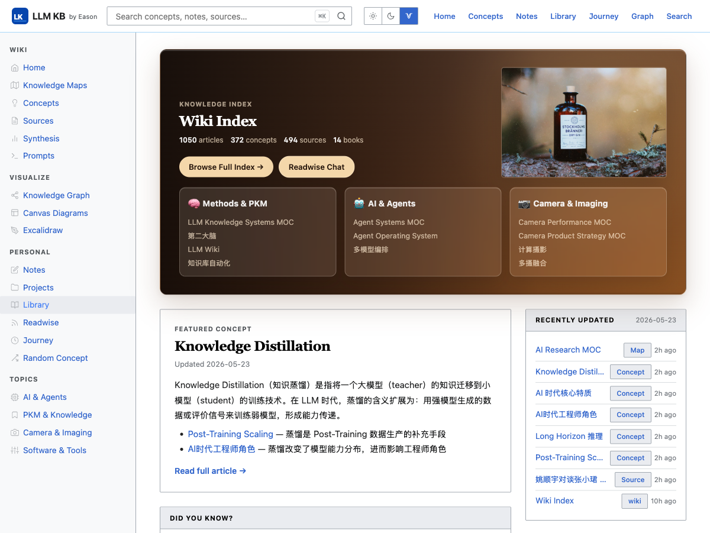
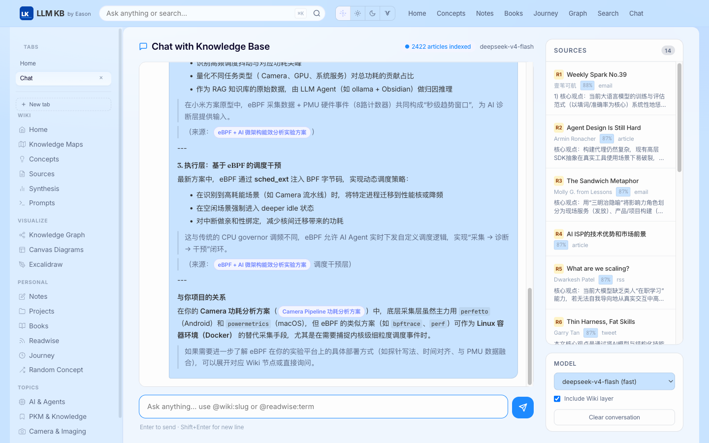
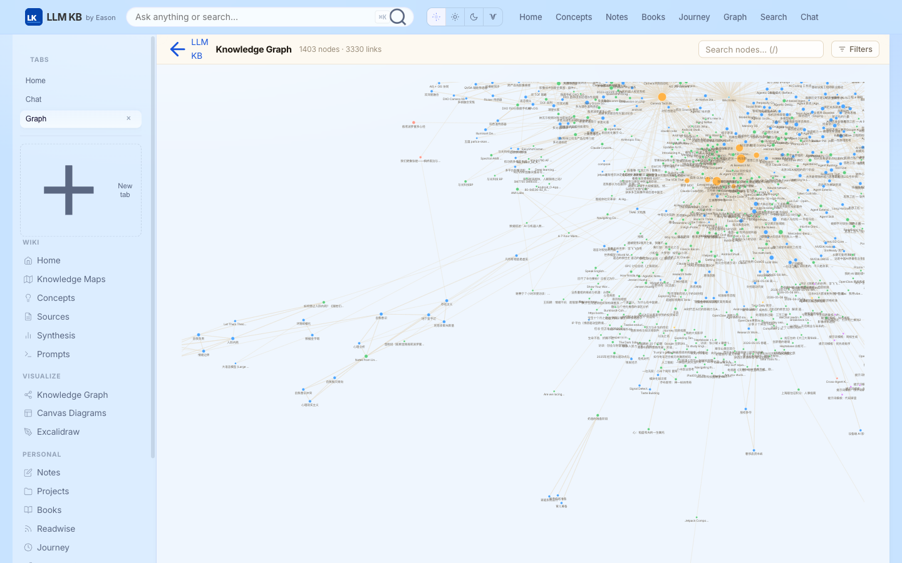
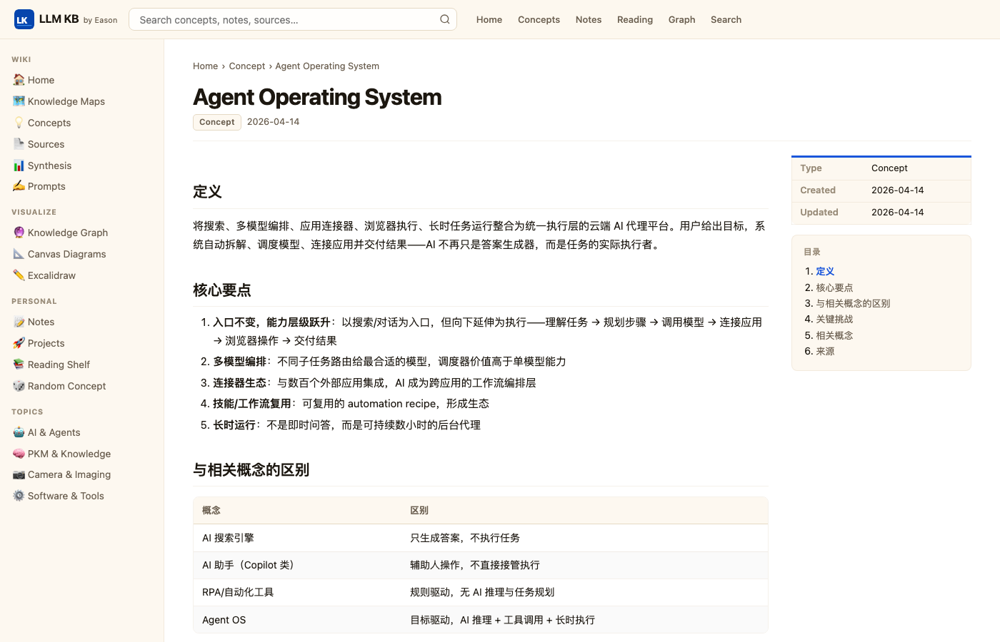
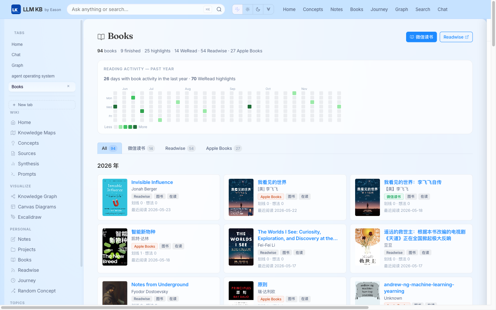
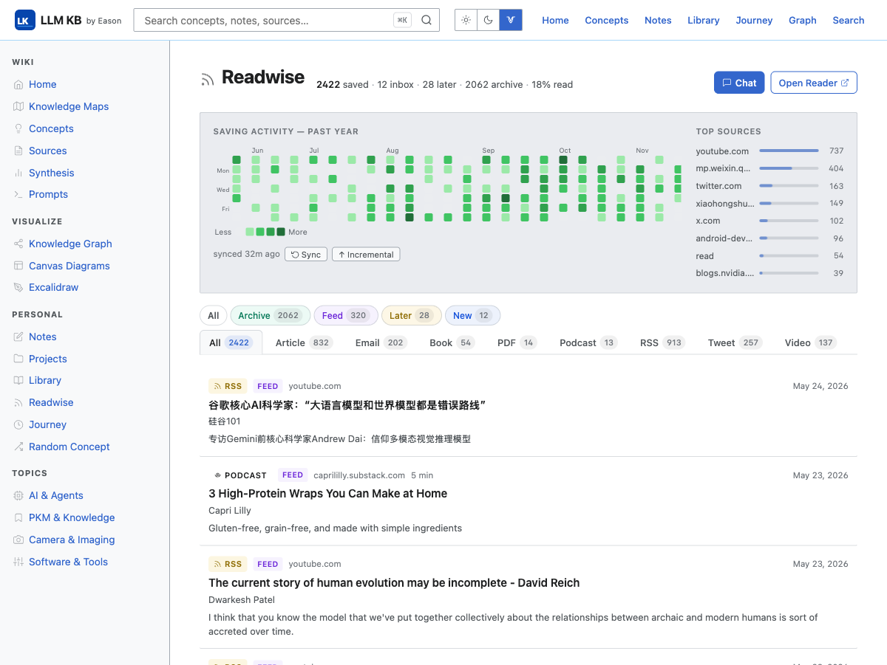

# LLM WIPA — Personal Knowledge Base

> **W**ikipedia-**I**nspired **P**ersonal **A**rchive  
> A local web app for Obsidian vaults with semantic search, RAG chat, and MCP integration.

[](https://nodejs.org)
[](LICENSE)

---

## What Is This?

LLM WIPA turns your Obsidian vault into a locally-served knowledge base — searchable, browseable, and queryable by AI. It reads vault files directly, embeds your Readwise library for semantic search, exposes a RAG chat interface, and ships an MCP server so Raycast AI and Claude Code can draw from your knowledge while you work.

Everything runs on your machine. Nothing leaves it.

---

## Philosophy: KB × Agent — The Bidirectional Loop

LLM WIPA is built on one core idea: **your personal knowledge base and your AI agents should continuously feed each other.**

Most people use AI and their notes as two separate systems. The insight here is to make them one loop — where every conversation enriches the KB, and every KB entry sharpens the next conversation.

### How the loop works

```
You (reading, working, thinking)
        │
        ▼
  AI Agents ──────── query ──────────► KB (via MCP)
  (Claude Code,                         │
   Raycast AI,      ◄── enriched ───────┘
   Cursor, Craft,        answers
   Hermes, ...)
        │
        │ write back (automations)
        ▼
  KB grows smarter
```

**KB → Agent (Pull direction)**

Every agent you work with queries the KB via the built-in MCP server before answering. Claude Code reads `CLAUDE.md` which instructs it to check the Wiki index first. Raycast AI pulls from `search_readwise` and `search_wiki`. Cursor and other MCP-compatible tools do the same. Your personal context — curated notes, highlights, frameworks — shapes every answer instead of relying on generic model knowledge.

Key MCP tools exposed:

| Tool | What it gives agents |
|---|---|
| `search_wiki` | Keyword search over your compiled wiki articles |
| `search_readwise` | Semantic search over 2000+ Readwise highlights |
| `read_wiki_article` | Full markdown of any article by slug |
| `ask_knowledge_base` | Full RAG answer with citation links |

**Agent → KB (Push direction)**

Agents write back into the KB through daily and weekly automations:

| Automation | What flows in | Destination |
|---|---|---|
| Daily AI Signal Brief | AI news digest, camera engineering signals | `Journey/YYYY-MM-DD.md` |
| Memory journal sync | Key decisions and insights from conversations | `Journey/YYYY-MM-DD.md` |
| Readwise daily sync | New highlights and articles (07:00 cron) | `Raw/readwise-sync-data.json` |
| Tana → Wiki export | `#wiki` tagged Tana nodes | `Wiki/sources/` |
| Tana literature sync | `#literature-note`, `#book`, `#article` nodes | `Wiki/sources/` |
| wiki-ingest | Any article or video studied | `Wiki/sources/` + concepts |
| Work indexer | Project docs and work notes | `Raw/work/` |

**The shared skill layer**

A unified set of skills runs across all agent frontends — Claude Code, Craft Agents, Raycast AI, Cursor, Hermes. The same `wiki-query`, `wiki-ingest`, `memory-journal-sync`, and `tana-wiki-export` skills reach into the same vault regardless of which surface you're working from. You write a skill once; every agent benefits.

Skills live in the vault at `{VAULT_PATH}/share-skills/` (canonical source) and are symlinked or copied into each agent's skill directory (e.g. `~/.claude/skills/`).

**The result**

Your KB grows with every session. Agents don't start cold — they start from your accumulated understanding. Over time the loop compounds: richer KB → better agent answers → more insights worth capturing → richer KB.

---

## Agent Integration

LLM WIPA is designed as the **shared brain** for all local AI agents — not a standalone web app. New agents plug in through three surfaces; you usually need only one or two.

### Design: three integration surfaces

```
┌──────────────────────────────────────────────────────────────────┐
│                        LOCAL AGENT LAYER                          │
│  Claude Code · Cursor · Raycast AI · Craft Agents · Hermes · …   │
└───────┬────────────────────┬─────────────────────┬────────────────┘
        │                    │                     │
   MCP stdio            HTTP / SSE            Skills + Vault FS
   (Pull, preferred)   (Pull, direct)        (Pull + Push)
        │                    │                     │
        ▼                    ▼                     ▼
┌───────────────┐   ┌─────────────────┐   ┌──────────────────────┐
│  mcp/         │   │  Express :3000  │   │  {VAULT_PATH}/       │
│  4 tools      │──►│  /api/*         │   │  share-skills/       │
│               │   │  /chat (SSE)    │   │  Wiki/ Raw/ Journey/ │
└───────────────┘   └─────────────────┘   └──────────────────────┘
```

| Surface | Direction | When to use | Examples |
|---|---|---|---|
| **MCP server** (`mcp/`) | KB → Agent (Pull) | Agent supports MCP (Cursor, Claude Code, Raycast AI) | `search_wiki`, `ask_knowledge_base` |
| **HTTP API** (`localhost:3000`) | KB → Agent (Pull) | Custom scripts, agents without MCP, skill curl calls | `/api/semantic-search`, `/api/chat` |
| **Shared skills** (`share-skills/`) | Agent → KB (Push) + guided Pull | Any agent that reads SKILL.md / rules | `wiki-ingest`, `memory-journal-sync` |
| **Vault filesystem** | Agent → KB (Push) | Direct read/write of Obsidian markdown | Append to `Journey/YYYY-MM-DD.md` |

**Pull** = agent queries your KB before answering (MCP or HTTP).  
**Push** = agent writes insights back into the vault (skills + automations → `Journey/`, `Wiki/sources/`, `Raw/`).

### How to add a new local agent

**1. Prerequisites (all paths)**

```bash
npm start                    # llm-wipa server on :3000
cd mcp && npm install        # only if using MCP
```

Ensure `.env` has `VAULT_PATH` pointing at your Obsidian vault root.

**2. Pull — MCP (recommended if the agent supports it)**

Add the `llm-kb` MCP server to the agent's config. Same JSON everywhere; only the config file location differs:

| Agent | Config location |
|---|---|
| Claude Code | `~/.claude/settings.json` → `mcpServers` |
| Cursor | `.cursor/mcp.json` or Cursor Settings → MCP |
| Raycast AI | Settings → Extensions → AI → MCP Servers |

```json
{
  "llm-kb": {
    "command": "node",
    "args": ["/path/to/llm-wipa/mcp/index.js"],
    "env": {
      "VAULT_PATH": "/path/to/your/obsidian/vault",
      "KB_API_URL": "http://localhost:3000"
    }
  }
}
```

MCP tools delegate to the running server:

| MCP tool | Backend |
|---|---|
| `search_readwise` | `GET /api/semantic-search` |
| `search_wiki` | `GET /api/search` |
| `read_wiki_article` | Direct vault read (`Wiki/{section}/*.md`) |
| `ask_knowledge_base` | `POST /api/chat` (SSE aggregated) |

**3. Pull — HTTP API (no MCP)**

Any agent or script can call the server directly:

```bash
# Semantic search (Readwise)
curl "http://localhost:3000/api/semantic-search?q=agent+memory&k=5"

# Keyword search (Wiki)
curl "http://localhost:3000/api/search?q=记忆系统"

# Full RAG (SSE stream)
curl -N -X POST http://localhost:3000/api/chat \
  -H 'Content-Type: application/json' \
  -d '{"messages":[{"role":"user","content":"..."}],"useWiki":true}'
```

The `wiki-query` skill uses this pattern when MCP is unavailable.

**4. Push — shared skills**

Point the new agent at vault skills:

```
{VAULT_PATH}/share-skills/
├── wiki-query/          # Guided KB Q&A (INDEX → MOC → concepts)
├── wiki-ingest/         # Raw → Wiki compiler
├── memory-journal-sync/ # Conversation → Journey/
├── work-indexer/        # Raw/work/ → wiki-ingest
└── tana-wiki-export/    # Tana → Wiki/sources/
```

For Claude Code / Cursor: symlink or copy into `~/.claude/skills/` / `.cursor/skills/`.  
For Craft Agents: reference the same `share-skills/` paths in project prompts or skill config.

**5. Agent-specific hints**

Add a one-line rule so the agent knows to query KB first:

```markdown
Before answering knowledge questions, use MCP tools search_wiki / search_readwise
or call http://localhost:3000/api/semantic-search. Prefer Wiki promoted content over model memory.
```

For agents that write back: enable `memory-journal-sync` at end of long sessions.

### Current agent matrix

| Agent | Pull (MCP) | Pull (HTTP) | Push (skills) | Notes |
|---|---|---|---|---|
| Claude Code | ✅ | via skills | ✅ | `CLAUDE.md` + `~/.claude/skills/` |
| Cursor | ✅ | via skills | ✅ | MCP + workspace rules |
| Raycast AI | ✅ | — | — | MCP-only pull; homepage banner has config |
| Craft Agents | — | via skills | ✅ | Project prompts + `share-skills/` |
| Hermes / OpenClaw | — | via skills | ✅ | Journey/ maps to OpenClaw memory |
| Browser UI | — | native | — | `/chat`, `/search` built-in |

### What you do *not* need

- No per-agent fork of llm-wipa — one server, one vault, many clients
- No cloud bridge — everything is localhost + vault filesystem
- No custom protocol — MCP stdio + plain HTTP JSON/SSE

See [MCP Server Setup](#mcp-server-setup-raycast-ai--claude-code--cursor) below for copy-paste configs.

---

## Screenshots

| Homepage | Chat with KB | Knowledge Graph |
|---|---|---|
|  |  |  |

| Article | Books | Readwise Dashboard |
|---|---|---|
|  |  |  |

---

## Features

### Knowledge Browser
- **Wikipedia-style articles** — sticky TOC, infobox, breadcrumb, tag pills, backlinks panel
- **`[[Wikilink]]` navigation** — click any `[[Title]]` to jump between notes; broken links shown as red stubs
- **Browse by section** — Concepts, Sources, MOCs, Synthesis, Prompts, Notes, Projects
- **Browse by tag** — click any `#tag` to see all articles
- **Full-text search** — MiniSearch with CJK tokenizer, autocomplete dropdown, field-weighted ranking
- **Live index** — chokidar watches the vault; edit a file, reload the page — index updates instantly

### Semantic Search
- Local embeddings via `@xenova/transformers` (`multilingual-e5-small`, 118 MB, multilingual, fully offline)
- **Readwise layer**: covers 2422+ articles — articles, books, emails, videos, tweets
- **Wiki layer**: covers all Wiki/Notes/Projects `.md` files, chunked at ~800 chars with overlap — 12,832 chunks total
- `GET /api/semantic-search?q=<query>&k=<n>` — returns top-K results with cosine similarity scores
- Both indices share a single model instance; dual hot-reload via chokidar
- Daily auto-sync and re-embed at 07:00 via launchd cron

### Chat with Knowledge Base
- `/chat` — RAG chat interface with a three-source retrieval pipeline:
  1. **R layer**: semantic search over Readwise (top 6, score ≥ 0.78)
  2. **W-vec layer**: semantic search over Wiki/Notes/Projects (top 8, score ≥ 0.65, semantic-first)
  3. **W-kw layer**: MiniSearch keyword search fills remaining W slots
- Streaming via SSE — tokens appear as they're generated
- Citation links — `[R1]` / `[W1]` rendered as clickable badges linking to source URL or wiki article
- Sources panel — lists all retrieved sources with author, category, match score, and summary
- Mermaid diagram rendering with syntax-error fallback
- Table and code block rendering
- Viewport-locked layout — chat area scrolls internally; no page-level scroll drift

### Reading & Library
- **Books** — unified shelf: WeRead + Readwise + Apple Books, year-grouped with 52-week reading heatmap
- **Journey** — reverse-chronological daily memory timeline with activity heatmap
- **Readwise dashboard** — saving activity heatmap, top sources chart, full library with category/location filters

### Visualizations
- **Knowledge Graph** — D3 force-directed graph of all wikilink connections; color by section; searchable; draggable
- **Canvas Viewer** — renders Obsidian `.canvas` files as interactive pan/zoom diagrams
- **Excalidraw Viewer** — renders `.excalidraw` JSON as SVG (no React, no external deps)
- **Mermaid** — diagram rendering in articles and chat

### MCP Server (`mcp/`)
Exposes the knowledge base as MCP tools — compatible with Raycast AI, Claude Code, Cursor, and any MCP client.

| Tool | Description |
|---|---|
| `search_readwise` | Semantic search over Readwise library |
| `search_wiki` | Keyword search over compiled wiki |
| `read_wiki_article` | Full markdown content of any wiki article |
| `ask_knowledge_base` | Full RAG answer with source attribution |

---

## Tech Stack

| Layer | Technology |
|---|---|
| Server | Express (Node.js) |
| Markdown | marked + custom wikilink extension |
| Full-text search | MiniSearch |
| Semantic search | @xenova/transformers (`multilingual-e5-small`) |
| LLM / Chat | DeepSeek API (OpenAI-compatible SDK) |
| Graph | D3.js v7 force simulation |
| Diagrams | Mermaid (bundled) |
| Syntax highlight | highlight.js |
| File watching | chokidar |
| MCP | @modelcontextprotocol/sdk |

---

## Project Structure

```
llm-wipa/
├── server.js                        # Express entry + chokidar watchers
├── config.js                        # Reads VAULT_PATH, PORT, etc. from env
├── .env.example
│
├── scripts/
│   ├── sync-readwise.js             # Fetch Readwise → Raw/readwise-sync-data.json
│   ├── embed-readwise.js            # Embed articles → Raw/readwise-vector-index.json
│   ├── embed-wiki.js                # Embed Wiki/Notes/Projects → Raw/wiki-vector-index.json
│   └── sync-and-embed.sh            # Daily cron: sync + embed (incremental)
│
├── src/
│   ├── vault/
│   │   ├── loader.js                # Glob vault, build slug/title maps
│   │   ├── parser.js                # Inline blockquote metadata + YAML fallback
│   │   ├── wikilinks.js             # [[Title]] → /wiki/slug resolver
│   │   ├── backlinks.js             # Reverse index: title → files
│   │   ├── canvas.js                # Load Obsidian .canvas files
│   │   └── excalidraw.js            # Load .excalidraw files
│   ├── search/
│   │   ├── index.js                 # MiniSearch build/query
│   │   └── vectorStore.js           # Load embeddings, cosine search
│   ├── render/
│   │   ├── markdown.js              # marked + wikilink + image extensions
│   │   ├── toc.js                   # H2/H3/H4 → nested TOC HTML
│   │   ├── assets.js                # ![[img.png]] → vault Assets/ resolver
│   │   └── template.js              # Lightweight {{var}} / {{{raw}}} template engine
│   └── routes/
│       ├── home.js                  # GET /
│       ├── article.js               # GET /wiki/:slug
│       ├── browse.js                # GET /browse/:section, /browse/tags/:tag
│       ├── search.js                # GET /search?q=
│       ├── chatRoute.js             # GET /chat, POST /api/chat (SSE)
│       ├── semanticSearch.js        # GET /api/semantic-search
│       ├── libraryRoute.js          # GET /books, /reading/:slug
│       ├── journeyRoute.js          # GET /journey, /journey/:date
│       ├── graph.js                 # GET /graph, /api/graph
│       ├── canvasRoute.js           # GET /diagrams, /diagrams/:slug
│       ├── excalidrawRoute.js       # GET /excalidraw, /excalidraw/:slug
│       ├── readwiseRoute.js         # GET /readwise
│       └── api.js                   # GET /api/search, /api/random
│
├── views/                           # HTML templates ({{var}} / {{{raw}}} interpolation)
│   ├── layout.html                  # Base shell: header + sidebar + footer
│   ├── home.html                    # Homepage with MCP onboarding banner
│   ├── chat.html                    # Chat UI: messages + sources panel
│   ├── article.html
│   ├── browse.html
│   ├── search.html
│   ├── books.html
│   ├── journey.html
│   ├── readwise.html
│   ├── graph.html
│   ├── canvas.html
│   └── excalidraw.html
│
├── public/
│   ├── css/main.css                 # Full design system (warm amber + dark mode)
│   ├── js/                          # search.js, toc-highlight.js, mobile-nav.js
│   └── vendor/                      # d3.min.js, mermaid.min.js
│
├── mcp/                             # MCP server (co-located, own package.json)
│   ├── index.js                     # stdio MCP server entry
│   ├── src/
│   │   ├── config.js
│   │   └── tools/
│   │       ├── searchReadwise.js
│   │       ├── searchWiki.js
│   │       ├── readWikiArticle.js
│   │       └── askKB.js
│   └── README.md
│
├── launchd/
│   └── com.llm-wipa.readwise-sync.plist  # Daily 07:00 cron for sync + embed
│
└── docs/
    ├── PRD.md                       # Product requirements document
    └── screenshots/
```

---

## Setup

### Prerequisites

- Node.js 20.6+ (uses built-in `--env-file` flag)
- An Obsidian vault with `Wiki/` subdirectory

### Install

```bash
git clone https://github.com/GeoffBao/llm-wipa-personal.git
cd llm-wipa-personal
npm install
```

### Configure

```bash
cp .env.example .env
```

Edit `.env`:

```env
# Absolute path to your Obsidian vault root
VAULT_PATH=/path/to/your/obsidian/vault

# Server port (default 3000)
PORT=3000

# Readwise API token — get from https://readwise.io/access_token
READWISE_TOKEN=your_token_here

# DeepSeek API key — for /chat RAG interface
CHAT_API_KEY=your_deepseek_key
CHAT_BASE_URL=https://api.deepseek.com/v1
CHAT_MODEL=deepseek-chat

# WeRead cookie (optional — for Books page reading progress)
WEREAD_COOKIE=wr_skey=xxx; wr_vid=xxx; ...
```

### Run

```bash
npm start
# or for dev (auto-restart on server code changes):
npm run dev
```

Open [http://localhost:3000](http://localhost:3000).

---

## Semantic Search Setup

### Readwise index

```bash
# First run — full embed (~2 min for 2422 articles, model downloads ~118 MB on first run)
node --env-file=.env scripts/embed-readwise.js

# Incremental — only embeds new/updated articles
node --env-file=.env scripts/embed-readwise.js --incremental
```

Writes to `Raw/readwise-vector-index.json`. Powers the R layer in Chat.

### Wiki index

```bash
# First run — embeds all Wiki/Notes/Projects .md files (~5-10 min, 1400+ files → 12k chunks)
node --env-file=.env scripts/embed-wiki.js

# Incremental — only re-embeds files modified since last run (mtime-based)
node --env-file=.env scripts/embed-wiki.js --incremental
```

Writes to `Raw/wiki-vector-index.json` (~100 MB). Powers the W-vec layer in Chat. Run once after initial setup; re-run incrementally when you add many new notes.

Both indices hot-reload automatically when updated on disk.

---

## Sync Scripts

### Readwise

```bash
# Full sync
node --env-file=.env scripts/sync-readwise.js

# Incremental (fast, only new items)
node --env-file=.env scripts/sync-readwise.js --incremental
```

### WeRead (微信读书)

```bash
node --env-file=.env scripts/sync-weread.js
```

**Getting your WeRead cookie:** `weread.qq.com` → login → DevTools → Network → any `/web/` request → copy the `Cookie` request header.

---

## Auto-Start & Daily Sync (macOS)

### Always-on server

Create `~/Library/LaunchAgents/com.llm-wipa.server.plist`:

```xml
<?xml version="1.0" encoding="UTF-8"?>
<!DOCTYPE plist PUBLIC "-//Apple//DTD PLIST 1.0//EN" "http://www.apple.com/DTDs/PropertyList-1.0.dtd">
<plist version="1.0">
<dict>
  <key>Label</key><string>com.llm-wipa.server</string>
  <key>ProgramArguments</key>
  <array>
    <string>/opt/homebrew/bin/node</string>
    <string>--env-file=.env</string>
    <string>/path/to/llm-wipa/server.js</string>
  </array>
  <key>WorkingDirectory</key><string>/path/to/llm-wipa</string>
  <key>RunAtLoad</key><true/>
  <key>KeepAlive</key><true/>
  <key>EnvironmentVariables</key>
  <dict>
    <key>PATH</key><string>/opt/homebrew/bin:/usr/local/bin:/usr/bin:/bin</string>
  </dict>
</dict>
</plist>
```

```bash
launchctl load ~/Library/LaunchAgents/com.llm-wipa.server.plist
```

### Daily sync + embed cron

Copy the included plist:

```bash
cp launchd/com.llm-wipa.readwise-sync.plist ~/Library/LaunchAgents/
launchctl load ~/Library/LaunchAgents/com.llm-wipa.readwise-sync.plist
```

Runs daily at 07:00: sync Readwise → embed new articles → server auto-reloads vector index.

---

## MCP Server Setup (Raycast AI / Claude Code / Cursor)

Install dependencies:

```bash
cd mcp && npm install
```

> **Requires** `llm-wipa` running at `http://localhost:3000` (`npm start`). MCP tools proxy to this server except `read_wiki_article`, which reads the vault directly.

### Raycast AI

Raycast → Settings → Extensions → AI → **MCP Servers** → add:

```json
{
  "llm-kb": {
    "command": "node",
    "args": ["/path/to/llm-wipa/mcp/index.js"],
    "env": {
      "VAULT_PATH": "/path/to/your/obsidian/vault",
      "KB_API_URL": "http://localhost:3000"
    }
  }
}
```

### Claude Code

Add to `~/.claude/settings.json`:

```json
{
  "mcpServers": {
    "llm-kb": {
      "command": "node",
      "args": ["/path/to/llm-wipa/mcp/index.js"],
      "env": {
        "VAULT_PATH": "/path/to/your/obsidian/vault",
        "KB_API_URL": "http://localhost:3000"
      }
    }
  }
}
```

Add to `~/.claude/CLAUDE.md` or project `CLAUDE.md`:

```markdown
## MCP: LLM KB
Tools: search_readwise, search_wiki, read_wiki_article, ask_knowledge_base
Query the personal KB before answering knowledge questions.
Skills in share-skills/: wiki-query, wiki-ingest, memory-journal-sync.
```

### Cursor

Add to `.cursor/mcp.json` (project) or Cursor Settings → MCP:

```json
{
  "mcpServers": {
    "llm-kb": {
      "command": "node",
      "args": ["/path/to/llm-wipa/mcp/index.js"],
      "env": {
        "VAULT_PATH": "/path/to/your/obsidian/vault",
        "KB_API_URL": "http://localhost:3000"
      }
    }
  }
}
```

Symlink vault skills for Push workflows:

```bash
ln -sf "$VAULT_PATH/share-skills/wiki-query" ~/.claude/skills/wiki-query   # example
# or configure Cursor skills to read from {VAULT_PATH}/share-skills/
```

### Other MCP-capable agents

Use the same `llm-kb` JSON block. Set `KB_API_URL` if the server runs on a non-default port. For agents without MCP, use [HTTP API](#agent-integration) or `wiki-query` skill curl patterns.

Once configured, your AI assistant will call `search_readwise`, `search_wiki`, and `ask_knowledge_base` automatically when answering knowledge questions.

---

## Routes

| Route | Description |
|---|---|
| `GET /` | Homepage — Wiki Index hero, MOC grid, recent updates, featured concept |
| `GET /wiki/:slug` | Article page with TOC, infobox, backlinks |
| `GET /chat` | RAG chat interface |
| `GET /browse/:section` | All articles in a section |
| `GET /browse/tags/:tag` | All articles with a tag |
| `GET /search?q=` | Full-text search results |
| `GET /books` | Unified books shelf — WeRead + Readwise + Apple Books |
| `GET /readwise` | Readwise Reader dashboard |
| `GET /journey` | Daily memory timeline |
| `GET /graph` | D3 knowledge graph |
| `GET /diagrams` | Canvas diagram gallery |
| `GET /excalidraw` | Excalidraw drawing gallery |
| `GET /api/search?q=` | JSON autocomplete results |
| `GET /api/semantic-search?q=&k=` | JSON semantic search results |
| `POST /api/chat` | SSE streaming RAG chat |
| `GET /api/graph` | JSON graph data |
| `GET /api/random` | JSON random concept |

---

## Vault Structure

```
YourVault/
├── Wiki/
│   ├── concepts/        # Core knowledge concepts
│   ├── sources/         # Book/article summaries
│   ├── mocs/            # Maps of Content
│   ├── synthesis/       # Synthesized insights
│   └── prompts/         # Prompt templates
├── Notes/               # Personal notes (browseable, searchable)
├── Projects/            # Project documentation
├── Journey/             # Daily memory entries (YYYY-MM-DD.md) — Agent → KB push target
├── share-skills/        # Canonical agent skills (wiki-query, wiki-ingest, …)
└── Raw/
    ├── readwise-sync-data.json      # Readwise library (from sync script)
    ├── readwise-vector-index.json   # Readwise embeddings (from embed-readwise.js)
    └── wiki-vector-index.json       # Wiki/Notes/Projects embeddings (from embed-wiki.js)
```

### Metadata format

Inline blockquote (Obsidian-native, preferred):
```markdown
> Type: #concept
> Tags: #agent #llm
> Created: 2025-01-15
```

YAML frontmatter (fallback, common in Readwise/WeRead imports):
```yaml
---
title: My Note
author: John Doe
tags: [agent, llm]
---
```

---

## Design

- Warm cream background (`#fdf8f0`) with blue/amber accents — easy on the eyes for long reading sessions
- Frosted-glass sticky header
- Light / Dark / Wikipedia theme switcher
- CJK-aware typography (`line-height: 1.7`, `word-break: break-word`)
- Responsive layout

---

## License

MIT — use it, fork it, make it yours.

---

*Built by Eason · [llm-wipa-personal](https://github.com/GeoffBao/llm-wipa-personal)*
