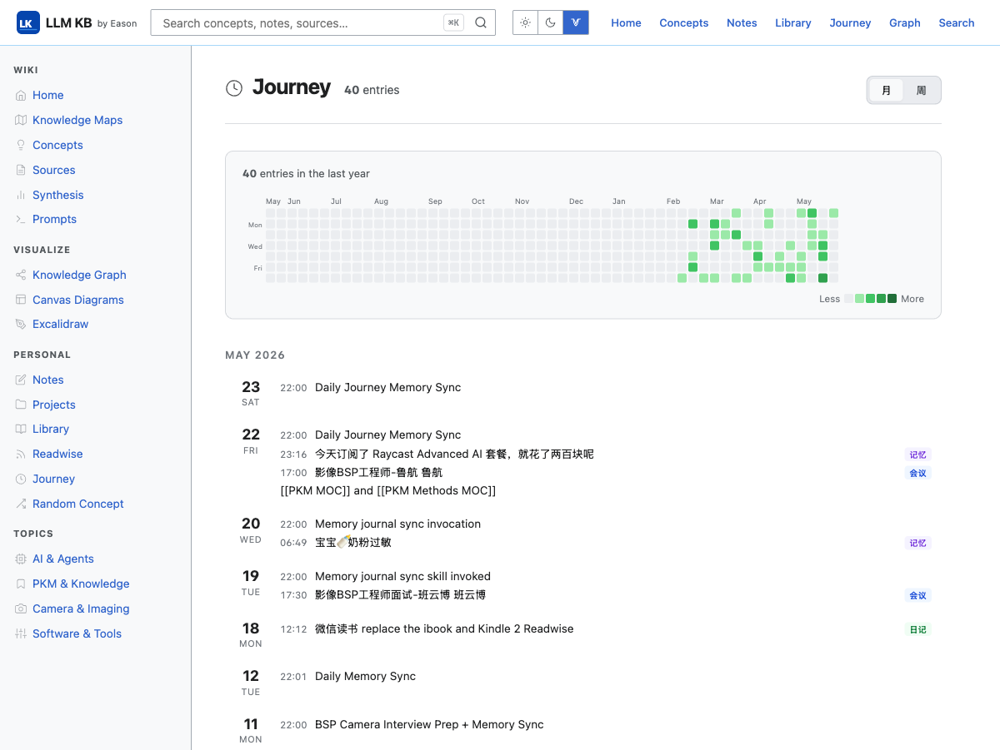

# LLM WIPA — Eason's Personal Knowledge Base

> **W**ikipedia-**I**nspired **P**ersonal **A**rchive  
> A local web interface for Obsidian vaults — built by Eason, for anyone who thinks in networks.

---

## Screenshots

### Homepage — Wiki Index & Domain Navigation

The homepage opens with a bold **Wiki Index** hero card surfacing three domain clusters (Methods & PKM, AI & Agents, Camera & Imaging) with direct links to key articles. Below: a featured concept of the day, a *Did You Know?* digest, and a **Recently Updated** feed showing the latest vault modifications — all live as you edit in Obsidian.

---

### Books — Year-Grouped Reading Shelf

The **Books** page aggregates reading from two sources: **微信读书** (WeRead, 14 books) and **Readwise** (54 epub books). Books are grouped by year (2026年 / 2025年 / 2024年…). Each horizontal card shows cover, title, author, source badges (已同步 · 图书 · 已读/在读), highlight & note counts (划线 X · 想法 X), and last-read date. A 52-week reading activity heatmap based on WeRead highlight timestamps sits at the top. Full dark-mode support.

---

### Readwise Dashboard — Decoupled Sync Architecture

The Readwise dashboard shows your full **Reader** library (2,422 items) with inline stats in the header. A two-column panel displays a 52-week **saving activity heatmap** and **top sources bar chart** side-by-side. Location tabs (All / Archive / Feed / Later / New) and category tabs (Article / Email / Book / PDF / Podcast / RSS / Tweet / Video) let you drill into any slice. Sync runs as a background script — no API calls on page load, always fast.

---

### Journey — Memory Timeline

The **Journey** page is a reverse-chronological log of daily memory entries with a 52-week activity heatmap at the top. Entries are grouped by month. Each row shows the time, title, and an optional category badge (记忆, 会议, 日记). Month/week view toggles let you scan at different granularities.

---

### Knowledge Graph — D3 Force-Directed Wikilink Map

All notes become nodes in a live D3 force simulation. Node size scales with backlink count; color encodes section (Concept, Source, Map, Synthesis, Prompt, Note, Project). Nodes are draggable. A search box dims all non-matching nodes and their edges. Dense clusters emerge naturally where concepts are heavily cross-referenced.

---

### Article Page — Two-Column Layout with TOC & Infobox

Every article renders with a sticky right sidebar containing a structured **infobox** and a nested **table of contents** auto-generated from headings. The main column has breadcrumb, tag pills, rendered wikilinks, tables, code blocks, and a backlinks panel at the bottom.

---

### Canvas Viewer — Obsidian Diagrams in the Browser

`.canvas` files from the Obsidian vault are parsed and rendered as interactive pan/zoom diagrams — color-coded cards, labeled arrows, and grouped layout preserved exactly as designed in Obsidian.

---

## What Is This?

LLM WIPA turns your Obsidian markdown vault into a beautiful, fast, locally-served website — no cloud, no sync, no data leaving your machine. It reads your vault files directly and serves them as a Wikipedia-inspired knowledge base with full-text search, a D3 knowledge graph, wikilink navigation, Canvas diagrams, an Excalidraw viewer, a **unified Books page** aggregating WeRead + Readwise books, and a **Readwise Reader dashboard** backed by a background sync script.

Designed for vaults that grow into hundreds or thousands of files, with mixed Chinese/English content, heavy wikilink graphs, and structured metadata.

---

## Features

### Reading & Navigation
- **Wikipedia-style article pages** — infobox, sticky table of contents, breadcrumb, tag pills
- **Wikilink resolution** — `[[Page Title]]` links navigate between notes; unresolved links shown as red "missing" links
- **Backlinks panel** — every article shows what links to it
- **Browse by section** — Concepts, Sources, Maps, Synthesis, Prompts, Notes, Projects
- **Browse by tag** — click any tag to see all articles tagged with it

### Books (Unified Reading Shelf)
- **Aggregates two sources** — WeRead vault books (from Obsidian markdown files) + Readwise epub books (from sync data)
- **Year-grouped layout** — books separated by year (2026年 / 2025年 / 2024年…), 3-column responsive grid
- **Horizontal cards** — cover · title · author · source badges (已同步 / Readwise · 图书 · 已读/在读) · 划线 X · 想法 X · last-read date
- **52-week reading heatmap** — based on WeRead highlight timestamps, shows highlights count in the last year
- **Source filter tabs** — All / 微信读书 / Readwise
- **WeRead cookie sync** — `node --env-file=.env scripts/sync-weread.js` fetches fresh noteCount, progress, lastReadDate from WeRead API
- **Deduplication** — WeRead takes priority when the same book exists in both sources

### Journey
- **Daily memory timeline** — reverse-chronological log of markdown journal entries
- **52-week activity heatmap** — visualizes writing frequency over the past year
- **Month/week view toggle** — scan entries at different granularities
- **Category badges** — color-coded labels (记忆, 会议, 日记, etc.)

### Search
- **Full-text search** — powered by [MiniSearch](https://github.com/lucaoneto/minisearch) with CJK tokenizer
- **Autocomplete dropdown** — instant suggestions as you type
- **Field-weighted ranking** — title matches ranked above body matches
- **Live index** — vault file watcher rebuilds the index on every save (no restart needed)

### Visualizations
- **Knowledge Graph** — force-directed D3 graph of all wikilink connections; color-coded by section; searchable; draggable nodes
- **Canvas Viewer** — renders Obsidian `.canvas` files as interactive pan/zoom diagrams
- **Excalidraw Viewer** — renders `.excalidraw` JSON files as SVG; supports rectangles, ellipses, diamonds, arrows, text, pan/zoom
- **Flipbook (generative pixel UI)** — flipbook.page-style infinite visual browser, vault-grounded

### Readwise Integration
- **Background sync** — `node --env-file=.env scripts/sync-readwise.js` fetches Readwise API v3 and writes a local JSON file; the web page reads that file only — no API calls on page load
- **Incremental sync** — `--incremental` flag for fast updates; full sync on demand
- **Dashboard** — saving activity heatmap + top sources bar chart; location tabs; category tabs; reading progress + estimated read time
- **Books integration** — Readwise epub books also appear in the unified `/books` page

### Design
- Warm cream background (`#fdf8f0`) with blue/amber accents — easy on the eyes for long reading sessions
- Frosted-glass header with `backdrop-filter`
- Apple-inspired card lift interactions
- Responsive layout — works on tablet viewports
- CJK-aware typography (`line-height: 1.7`, `word-break: break-word`)
- Light / dark / Wikipedia theme switcher

### Developer Experience
- **Zero build step** — `npm start` serves the current vault state immediately
- **Hot reload** — `chokidar` watches the vault; edit a file, refresh the page
- **No framework** — pure Express + vanilla JS + server-rendered HTML templates
- **Configurable via `.env`** — vault path, Excalidraw path, port, Readwise token

---

## Tech Stack

| Layer | Technology |
|---|---|
| Server | [Express](https://expressjs.com/) (Node.js) |
| Markdown | [marked](https://marked.js.org/) with custom wikilink extension |
| Search | [MiniSearch](https://github.com/lucaoneto/minisearch) |
| Graph | [D3.js v7](https://d3js.org/) force simulation |
| Syntax highlight | [highlight.js](https://highlightjs.org/) |
| Diagrams | [Mermaid](https://mermaid.js.org/) (bundled) |
| File watching | [chokidar](https://github.com/paulmillr/chokidar) |
| YAML parsing | [js-yaml](https://github.com/nodeca/js-yaml) |
| Excalidraw render | Custom SVG renderer (no React, no external deps) |

---

## Project Structure

```
llm-wipa/
├── server.js                   # Express entry point + chokidar watcher
├── config.js                   # Reads VAULT_PATH, PORT, READWISE_TOKEN from environment
├── .env.example                # Environment variable template
│
├── scripts/
│   ├── sync-readwise.js        # Background Readwise sync → Raw/readwise-sync-data.json
│   └── sync-weread.js          # WeRead cookie sync → Raw/weread-sync-data.json
│
├── src/
│   ├── vault/
│   │   ├── loader.js           # Globs vault, builds slug/title maps
│   │   ├── parser.js           # Extracts inline blockquote metadata + YAML fallback
│   │   ├── wikilinks.js        # [[Title]] → /wiki/slug resolver
│   │   ├── backlinks.js        # Reverse index: title → Set<files>
│   │   ├── canvas.js           # Loads Obsidian .canvas JSON files
│   │   └── excalidraw.js       # Loads .excalidraw JSON files
│   ├── render/
│   │   ├── markdown.js         # marked instance with wikilink + image extensions
│   │   ├── toc.js              # H2/H3/H4 → nested TOC HTML
│   │   ├── assets.js           # ![[img.png]] → vault Assets/ resolver
│   │   └── template.js         # Lightweight {{var}} / {{{raw}}} / {{#if}} renderer
│   ├── search/
│   │   └── index.js            # MiniSearch build/query with CJK tokenizer
│   └── routes/
│       ├── home.js             # GET /
│       ├── article.js          # GET /wiki/:slug
│       ├── browse.js           # GET /browse/:section, /browse/tags/:tag
│       ├── search.js           # GET /search?q=
│       ├── libraryRoute.js     # GET /books, GET /reading/:slug
│       ├── journeyRoute.js     # GET /journey, GET /journey/:date
│       ├── graph.js            # GET /graph, GET /api/graph
│       ├── canvasRoute.js      # GET /diagrams, GET /diagrams/:slug
│       ├── excalidrawRoute.js  # GET /excalidraw, GET /excalidraw/:slug
│       ├── readwiseRoute.js    # GET /readwise
│       └── api.js              # GET /api/search, GET /api/random
│
├── views/
│   ├── layout.html             # Base shell: header + sidebar + footer
│   ├── home.html               # Homepage: INDEX hero, MOC grid, recent updates
│   ├── article.html            # Article: two-column layout with sticky sidebar
│   ├── browse.html             # Section/tag listing
│   ├── search.html             # Search results
│   ├── books.html              # Books: year-grouped heatmap + source tabs + book cards
│   ├── journey.html            # Journey timeline with activity heatmap
│   ├── readwise.html           # Readwise dashboard: heatmap + top sources + feed
│   ├── graph.html              # Full-screen D3 graph (standalone, no layout)
│   ├── canvas.html             # Canvas viewer (standalone)
│   ├── excalidraw.html         # Excalidraw viewer (standalone)
│   └── 404.html                # Not found with suggestions
│
└── public/
    ├── css/
    │   └── main.css            # Full stylesheet — warm amber design system
    ├── js/
    │   ├── search.js           # Autocomplete dropdown
    │   ├── toc-highlight.js    # IntersectionObserver TOC active state
    │   └── mobile-nav.js       # Sidebar hamburger toggle
    └── vendor/
        ├── d3.min.js
        └── mermaid.min.js
```

---

## Setup

### Prerequisites

- Node.js 20.6 or later (uses built-in `--env-file` flag)
- An Obsidian vault with a `Wiki/` subdirectory (or any folder of `.md` files)

### Install

```bash
git clone https://github.com/GeoffBao/llm-wipa-personal.git
cd llm-wipa-personal
npm install
```

### Configure

```bash
cp .env.example .env
```

Edit `.env`:

```env
# Absolute path to your Obsidian vault root (the folder containing Wiki/)
VAULT_PATH=/path/to/your/obsidian/vault

# Absolute path to your Excalidraw drawings folder (optional)
EXCALIDRAW_DIR=/path/to/your/Excalidraw

# Server port
PORT=3000

# Readwise API token (for Readwise dashboard + Library integration)
READWISE_TOKEN=your_token_here
```

### Run

```bash
npm start
```

Open [http://localhost:3000](http://localhost:3000).

For development with auto-reload on server-side changes:

```bash
npm run dev
```

> Vault file changes (editing markdown) are picked up immediately via chokidar — no restart needed. Only changes to source code require `npm run dev` reload.

### Sync Readwise

Run the background sync script to fetch your Readwise Reader library:

```bash
# Full sync (first run or weekly refresh)
node --env-file=.env scripts/sync-readwise.js

# Incremental sync (fast, only new/updated items)
node --env-file=.env scripts/sync-readwise.js --incremental
```

The script writes `Raw/readwise-sync-data.json` into your vault. The web server reads this file on page load — no live API calls, always instant.

### Sync WeRead (微信读书)

Fetch fresh book metadata (progress, highlight counts, last-read dates) from WeRead:

```bash
node --env-file=.env scripts/sync-weread.js
```

Required in `.env`:
```env
WEREAD_COOKIE=<full cookie string from weread.qq.com>
```

**How to get your cookie:** Open `weread.qq.com` in your browser → log in → DevTools → Network → any `/web/` request → copy the `Cookie` request header. Paste the full value as `WEREAD_COOKIE=` in `.env`. The script writes `Raw/weread-sync-data.json`; the Books page picks it up automatically on next load.

---

## Flipbook (Generative Pixel UI)

`/flipbook/:slug` is an experimental, [flipbook.page](https://flipbook.page)-style visual browser for any vault article. It renders a local SVG "pixel UI" frame from your vault graph: a center topic card, surrounding concept cards, curved edges, and deterministic click regions.

### How to use it

- From any wiki article, click the **Flipbook** button next to the section badge.
- Or open it directly: `http://localhost:3000/flipbook/agent-memory`.
- Click outer concept cards to jump to real vault articles.
- Click the center card to recursively explore the next set of related concepts.

### Caching

Frame JSON is cached on disk under `public/flipbook-cache/<key>.frame.json`. Delete it any time to regenerate.

---

## Vault Structure Expected

The loader indexes these subdirectories under `VAULT_PATH/Wiki/` by default:

```
Wiki/
├── concepts/       # Core knowledge concepts
├── sources/        # Books, articles, papers
├── mocs/           # Maps of Content (navigation hubs)
├── synthesis/      # Synthesized insights
├── prompts/        # Prompt templates
└── people/         # People notes
```

Additional paths indexed automatically:
- `Notes/` — personal notes (browseable, searchable)
- `Projects/` — project documentation
- `Raw/weread/` — WeRead book highlights (shown in Books page)
- `Journey/` — daily memory entries (shown in Journey timeline)

### Metadata Format

**Inline blockquote** (primary, Obsidian-native):
```markdown
> Type: #concept
> Created: 2025-01-15
> Updated: 2025-04-10
> Tags: #agent #llm
```

**YAML frontmatter** (fallback, common in Readwise/WeRead imports):
```yaml
---
title: My Note
author: John Doe
progress: 37%
noteCount: 12
cover: https://...
---
```

---

## Running as a Background Service (macOS)

Create a LaunchAgent to start the server automatically at login:

```xml
<!-- ~/Library/LaunchAgents/com.llm-wipa.server.plist -->
<?xml version="1.0" encoding="UTF-8"?>
<!DOCTYPE plist PUBLIC "-//Apple//DTD PLIST 1.0//EN" "http://www.apple.com/DTDs/PropertyList-1.0.dtd">
<plist version="1.0">
<dict>
  <key>Label</key>
  <string>com.llm-wipa.server</string>
  <key>ProgramArguments</key>
  <array>
    <string>/opt/homebrew/bin/node</string>
    <string>--env-file=.env</string>
    <string>/path/to/llm-wipa-personal/server.js</string>
  </array>
  <key>WorkingDirectory</key>
  <string>/path/to/llm-wipa-personal</string>
  <key>RunAtLoad</key>
  <true/>
  <key>KeepAlive</key>
  <true/>
  <key>EnvironmentVariables</key>
  <dict>
    <key>PATH</key>
    <string>/opt/homebrew/bin:/usr/local/bin:/usr/bin:/bin</string>
  </dict>
</dict>
</plist>
```

```bash
launchctl load ~/Library/LaunchAgents/com.llm-wipa.server.plist
```

---

## Raycast Integration

Three [Raycast](https://raycast.com/) scripts are included in `raycast-scripts/` to control and access the knowledge base directly from your macOS menu bar.

### Setup

```bash
chmod +x raycast-scripts/*.sh
```

Add the `raycast-scripts/` folder in Raycast → Extensions → Script Commands.

### Scripts

| Script | Description |
|---|---|
| `kb-status.sh` | Inline menu bar status badge — 🟢 Running / 🔴 Offline, auto-refreshes every 30s |
| `open-knowledge-base.sh` | Opens homepage in default browser; starts server if not running |
| `search-knowledge-base.sh` | Takes a query from Raycast search bar, opens `/search?q=` directly |

**Recommended hotkeys:** `⌥K` to open, `⌥F` to search.

---

## Pages & Routes

| Route | Description |
|---|---|
| `GET /` | Homepage — INDEX hero, MOC grid, recent updates, featured concept |
| `GET /wiki/:slug` | Article page with TOC, infobox, backlinks |
| `GET /browse/:section` | All articles in a section |
| `GET /browse/tags/:tag` | All articles with a tag |
| `GET /search?q=` | Full-text search results |
| `GET /books` | Unified books — WeRead + Readwise, year-grouped with heatmap |
| `GET /reading/:slug` | Individual WeRead book page |
| `GET /journey` | Daily memory timeline with activity heatmap |
| `GET /journey/:date` | Single journey entry |
| `GET /readwise` | Readwise Reader dashboard |
| `GET /graph` | Interactive D3 knowledge graph |
| `GET /diagrams` | Canvas diagram gallery |
| `GET /diagrams/:slug` | Single canvas diagram viewer |
| `GET /excalidraw` | Excalidraw drawing gallery |
| `GET /excalidraw/:slug` | Single Excalidraw viewer |
| `GET /api/search?q=` | JSON autocomplete results |
| `GET /api/random` | JSON `{ slug }` for random concept |
| `GET /api/graph` | JSON graph data for D3 |

---

## Design Philosophy

- **Local-first** — your knowledge never leaves your machine
- **No build step** — `npm start` and it works; no webpack, no bundler, no compilation
- **Vault as source of truth** — the app reads files directly; the vault stays pure Obsidian-compatible markdown
- **Scales gracefully** — MiniSearch stays fast to ~5,000 files; chokidar handles incremental updates
- **Typography for reading** — `line-height: 1.7`, `max-width: 860px` article body, CJK-aware text handling

---

## License

MIT — use it, fork it, make it yours.

---

*Built by Eason · [llm-wipa-personal](https://github.com/GeoffBao/llm-wipa-personal)*
