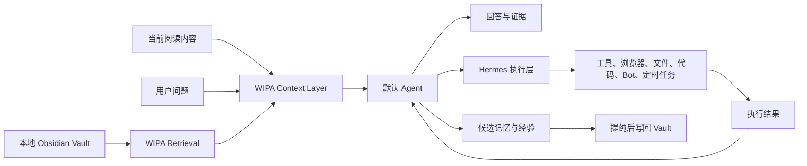

# LLM WIPA Reading Agent 产品设计

**日期：** 2026-07-11  
**状态：** 已完成 brainstorming，待用户审阅  
**产品分支：** `codex/agent-reading-product`

## 1. 产品定位

LLM WIPA 是一个桌面优先的阅读与知识查询 Agent。它帮助用户理解当前正在阅读的内容，并从长期个人知识库中找出相关背景、观点、历史决策和下一步行动。

它不是传统笔记软件、收藏夹、Readwise/Reader 替代品，也不要求用户手工维护文件夹和标签。用户面对的是一个默认存在的 Agent；知识库是 Agent 的长期记忆和证据底座。

核心表述：

> LLM WIPA 是你的阅读与认知控制台：为大脑提供外接缓存，并把阅读、对话和决策逐渐沉淀成可复用的个人认知资产。

## 2. 已确认的范围与约束

- 第一阶段只做桌面端；手机端暂不进入实现范围。
- 长期知识源固定为本地 Obsidian Vault：`/Users/admin/Workspace/Resources/obsidian/AI-KN-Base`。
- 不迁移或重建一套独立知识库数据库；WIPA 通过现有 vault 读取、检索和按既有规则写回。
- 默认 Agent 始终存在，用户不需要手工选择 WIPA Agent 或 Hermes Agent。
- Hermes Agent 作为执行层，不作为 WIPA 的唯一内核。
- 最终实现属于产品级改造，使用独立 Git 分支，不直接爆改主线。
- UI 与动效以 mymind 的体验规律为参考，以小红书的探索/详情/相关推荐节奏为参考，不复制品牌资产或具体页面。

## 3. 用户核心闭环

```text
打开文章、PDF 或 Wiki 内容
  ↓
向默认 Agent 提问
  ↓
WIPA 读取当前阅读上下文与本地 KB
  ↓
展示解释、个人关联、原文证据和相反观点
  ↓
必要时自动调用 Hermes 执行多步骤任务
  ↓
将确认后的结果提纯回 Wiki、Journey 或 Project memory
```

系统的价值不是保存更多内容，而是减少重复回溯，让个人阅读和行动形成复利。

## 4. 桌面信息架构

### 4.1 首页：Agent 起点

首页直接进入 Agent，而不是文件夹或笔记列表。

- 顶部：自然语言搜索/提问入口。
- 中部：最近阅读上下文和近期问题。
- 下方：与近期阅读相关的主题、证据和 Agent 发现。
- 侧边：轻量任务状态与待确认动作。
- 不展示传统笔记软件式的文件夹墙和复杂标签树。

### 4.2 阅读页：内容与 Agent 并排

阅读页采用桌面双栏工作区：

- 中央区域：文章、PDF、网页或 Wiki 正文。
- 右侧区域：默认 Agent，支持解释、检索、比较、关联和执行。
- 底部或抽屉：证据、来源、原文片段和相关知识卡片。
- Agent 面板可收窄，但默认不消失；它是阅读上下文的一部分。

### 4.3 发现层

借鉴小红书的瀑布流和详情页相关推荐，但只服务于理解当前内容：

- 相关概念。
- 相似阅读材料。
- 相反观点。
- 用户历史思考和决策。
- Agent 发现的知识连接。

每一次发现都必须能够回答“它为什么与当前内容有关”，并提供证据或明确标注为推断。

## 5. 视觉与交互方向

### 5.1 视觉关键词

- 安静。
- 留白。
- 有温度。
- 内容优先。
- Agent 有存在感但不喧宾夺主。
- 证据清楚且可信。

### 5.2 参考来源的适配

**mymind：** 借鉴低压力搜索、自由空间、柔和背景、卡片比例、轻量浮动入口和连续的空间感。

**小红书：** 借鉴内容瀑布流、详情页沉浸、相关推荐和“看一条自然发现下一条”的节奏，但不做信息消费流。

**LLM WIPA 自有差异：** 卡片必须围绕当前阅读上下文、个人知识关联和证据展开，而不是围绕点赞、收藏或内容消费展开。

### 5.3 动效原则

动效表达状态变化，不作为装饰：

- 页面进入：内容渐进展开，避免突然出现。
- Agent 理解：轻微呼吸、光点或线条流动。
- 找到关联：卡片或证据之间自然建立连接。
- 展示证据：从当前内容边缘平滑展开。
- 调用 Hermes：进入明确的执行状态，展示阶段和可取消状态。
- 执行完成：结果回到当前阅读上下文。
- 错误/确认：界面收敛并停留，不制造焦虑。

最终 UI/UX 验收目标是达到 mymind 级别的连贯性、细腻度和动效质量，同时保持 WIPA 的阅读、证据和 Agent 语义。

## 6. Agent 与运行时边界



### 6.1 WIPA 负责

- 当前阅读上下文。
- 本地 Wiki、Journey、Projects 检索。
- 来源、证据和推断标注。
- 用户问题与历史知识的关联。
- 候选记忆的分级、确认和写回。
- 桌面阅读体验、UI、动效和状态反馈。

### 6.2 Hermes 负责

- 多步骤任务执行。
- 浏览器、电脑、文件和代码操作。
- 定时任务和外部消息渠道。
- 可复用 Skills。
- 执行过程、审批和任务状态。

### 6.3 调用策略

- 简单解释和知识查询：WIPA 快速路径。
- 需要个人知识关联：WIPA Retrieval + 默认 Agent。
- 需要外部工具或多步骤操作：自动调用 Hermes。
- 涉及写入、发送、删除、执行命令或改变外部状态：必须进入确认流程。

用户只认识一个固定 Agent；Hermes 是默认 Agent 背后的执行能力。

## 7. 知识流与记忆策略

所有长期知识以本地 Vault 为准。WIPA 不把每次对话自动写成正式 Wiki 内容，而是区分：

- 当前上下文：只服务当前阅读和当前会话。
- 候选记忆：Agent 认为可能有长期价值的结论、偏好、决策或方法。
- 正式知识：经过规则或用户确认后写入 Wiki、Journey 或 Projects。
- 执行经验：Hermes 产生的任务结果和可复用方法，先作为候选记忆进入提纯流程。

规则：

1. 临时事实不自动升级为长期知识。
2. 外部网页内容必须保留来源和抓取时间。
3. Agent 推断必须与原文事实区分。
4. Hermes 不能直接污染 canonical Wiki。
5. 写回操作可追踪、可撤销、可重新编辑。

## 8. Hermes 集成方案

第一阶段优先采用 Hermes 的 OpenAI-compatible API 作为 WIPA 的调用入口，原因是它适合让现有桌面前端保持稳定，同时获得 Hermes 的工具和执行能力。

第二阶段让 Hermes 通过 MCP 访问 WIPA 的知识接口，例如：

- `search_wiki`
- `read_wiki_article`
- `ask_knowledge_base`
- `search_readwise`
- 项目上下文与 Journey 查询

ACP 作为未来需要把 Hermes 深度渲染成编辑器式 Agent 时的备用集成面；Messaging Gateway 负责外部 Bot 渠道，不替代 WIPA 桌面主入口。

所有 Hermes 调用必须经过：

- 本地 API 鉴权。
- 工具白名单和按任务过滤。
- 外部副作用确认。
- 执行日志和结果回传。
- 超时、取消、失败重试和人工接管。

## 9. 错误处理与降级

- Vault 不可访问：保留阅读界面，明确提示知识查询暂不可用。
- 检索无结果：允许 Agent 基于当前内容回答，并明确“未找到个人 KB 证据”。
- Hermes 不可用：WIPA 继续提供阅读和查询；将执行请求转为待重试任务。
- Hermes 执行失败：展示失败阶段、错误原因、可重试动作和人工接管入口。
- 写回失败：保留候选记忆和完整草稿，不丢失用户结果。
- 模型输出无来源：降低可信度显示，不把它渲染成确定事实。

## 10. 第一阶段范围

### 包含

- 桌面首页 Agent 起点。
- 阅读内容与 Agent 双栏工作区。
- 当前内容上下文传给 Agent。
- 本地 Obsidian Vault 的检索和证据展示。
- 相关知识/历史思考卡片。
- Hermes 作为默认 Agent 的执行后端。
- 执行状态、确认、取消和失败降级。
- mymind 式视觉系统和关键动效状态。

### 暂不包含

- 手机端体验。
- 独立云端知识库。
- 社交、分享、点赞和协作。
- 完整收藏/阅读稍后看产品。
- 自动把所有对话写成正式 Wiki。
- 多 Agent 选择器作为主交互。

## 11. 验收标准

### 产品

- 用户可以从当前阅读内容直接提问，不需要手工复制整理上下文。
- Agent 能返回个人 KB 关联，并展示可追溯证据。
- 需要执行时用户无需选择 Hermes；默认 Agent 自动路由。
- Hermes 不可用时，阅读和查询仍然可用。
- 候选记忆不会未经规则或确认直接污染正式 Vault。

### 视觉与交互

- 阅读区域始终保持清晰、安静和连续。
- Agent 的出现、关联、证据展开和执行状态都有一致动效语言。
- UI 不呈现为传统笔记软件，也不呈现为普通聊天窗口。
- 桌面宽度变化时，阅读内容和 Agent 面板都保持可用。
- 用户能理解每一条 Agent 结论来自原文、个人 KB 还是推断。

### 工程验证

- 检索接口、上下文拼装、Hermes 路由和写回提纯分别可测试。
- 关键路径覆盖：查询、无结果、Hermes 成功、Hermes 失败、确认取消、Vault 写回失败。
- 使用真实 Vault 的代表性文章进行端到端验证。
- UI 需要在现有明/暗主题和主要桌面宽度下检查。
- 实现完成后在独立产品分支完成测试与 GitHub 同步。

## 12. 分支与交付策略

实现开始前创建独立分支：

```text
codex/agent-reading-product
```

该分支承载完整产品化改造，包括桌面 IA、视觉系统、动效、WIPA Context Layer、Hermes 接入和验证。当前主线保持可运行，最终再将独立分支推送到 GitHub，用于代码审阅、对比、回退和后续产品演化。

## 13. 参考资料

- mymind Everything 页面：用户提供的私有产品参考页面。
- 小红书笔记：用户提供的“信息主权｜给大脑外接缓存 把时间蒸馏成资产”。
- [Hermes Agent API Server](https://hermes-agent.nousresearch.com/docs/user-guide/features/api-server/)
- [Hermes Agent MCP](https://hermes-agent.nousresearch.com/docs/user-guide/features/mcp)
- [Hermes Agent ACP](https://hermes-agent.nousresearch.com/docs/user-guide/features/acp/)
- [Hermes Agent 官方仓库](https://github.com/NousResearch/hermes-agent)
